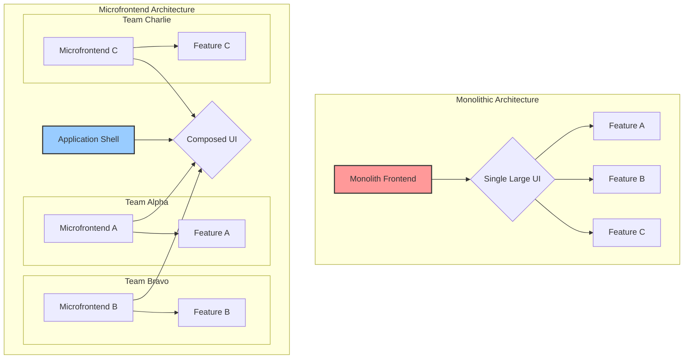
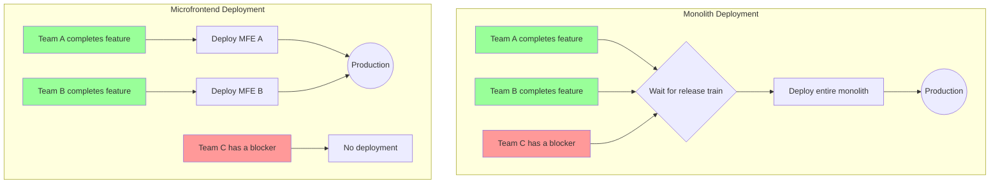
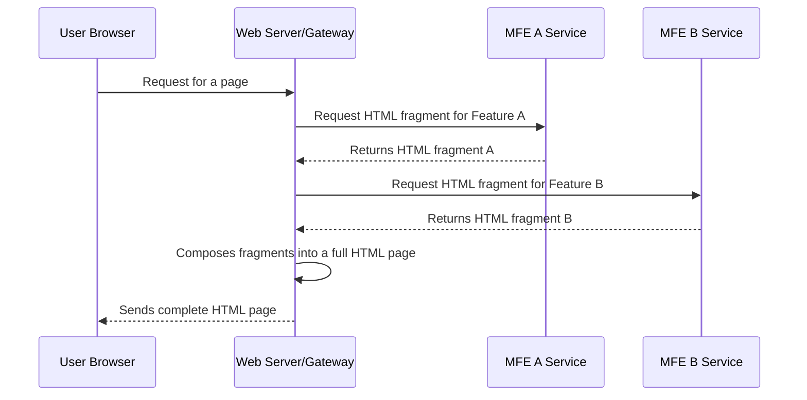
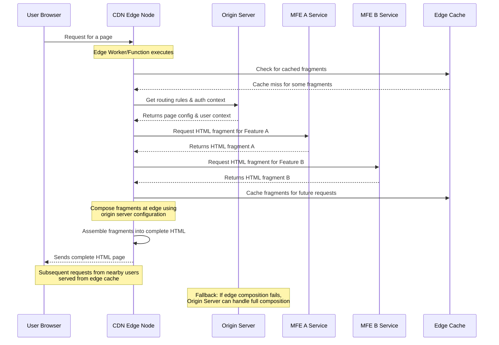
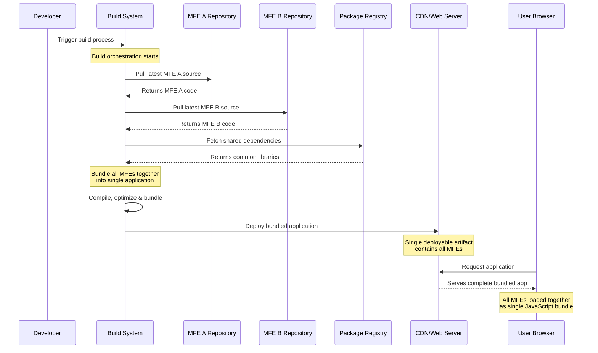
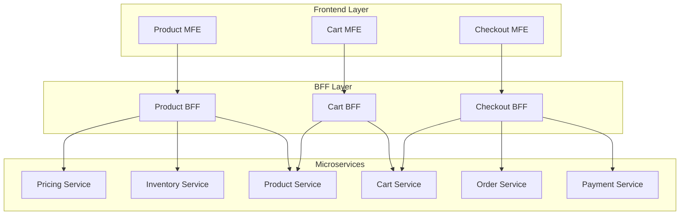
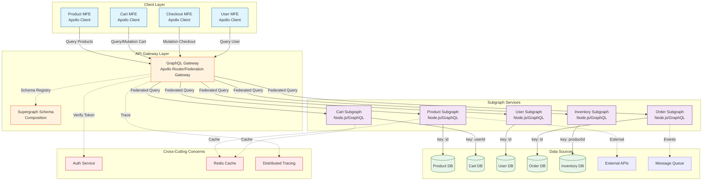
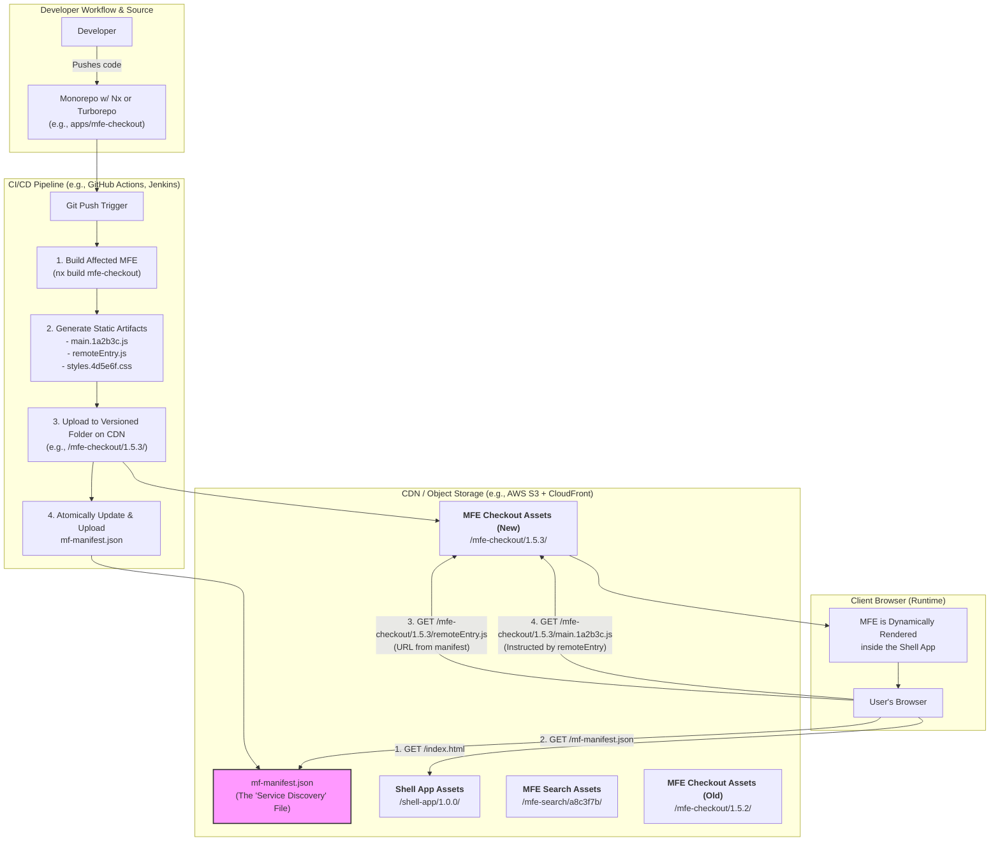
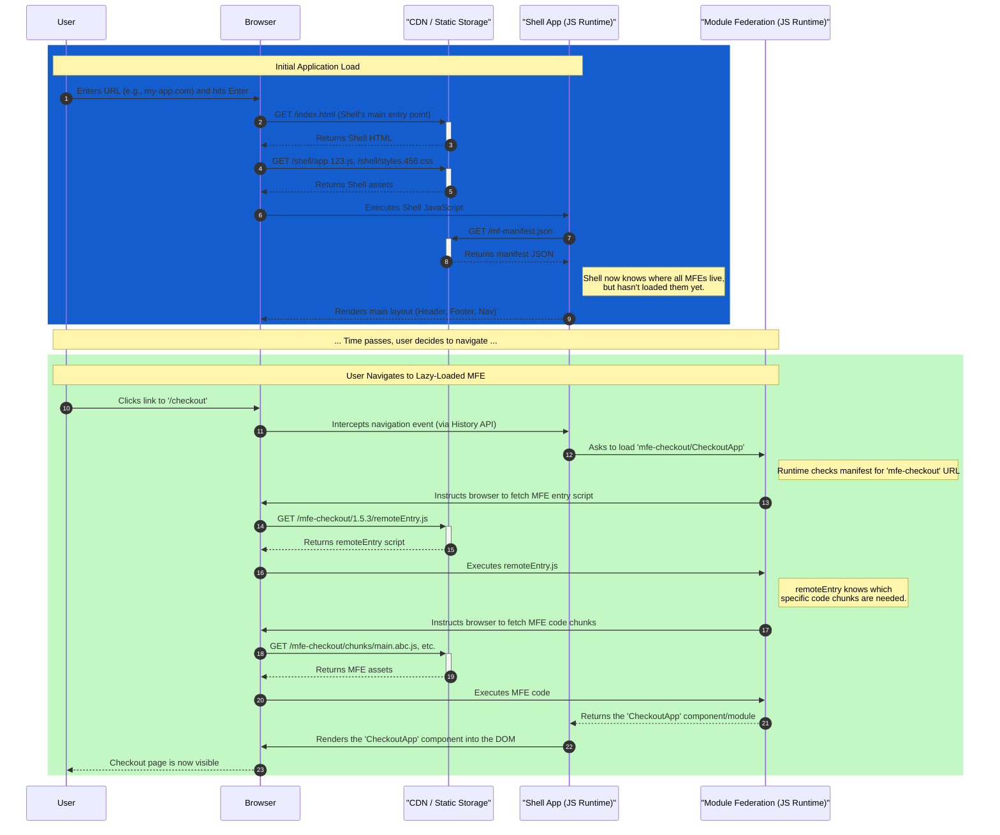

# Microfrontend Masterclass

## Table of Contents

- [Microfrontends](#microfrontends)
    - [Use Cases](#use-cases)
    - [Key Benefits](#key-benefits)
- [Integration Approaches](#integration-approaches)
    - [Server-side composition](#server-side-composition)
    - [Edge-side composition](#edge-side-composition)
    - [Build-time composition](#build-time-composition)
    - [Runtime Integration](#runtime-integration)
        - [Iframes (strong isolation)](#iframes-strong-isolation)
        - [Web Components (Custom Elements + Shadow DOM)](#web-components-custom-elements--shadow-dom)
        - [Module Federation](#module-federation)
        - [Single-spa](#single-spa)
        - [Import maps + SystemJS](#import-maps--systemjs)
- [Code Organization](#code-organization)
    - [Monorepo](#monorepo)
        - [Lerna (The OG)](#lerna-the-og)
        - [Nx (The Batteries-Included Framework)](#nx-the-batteries-included-framework)
        - [Turborepo (The High-Speed Task Runner)](#turborepo-the-high-speed-task-runner)
    - [Polyrepo (one repo per MFE)](#polyrepo-one-repo-per-mfe)
- [Styling](#styling)
    - [BEM](#bem)
    - [SASS](#sass)
    - [CSS Modules](#css-modules)
    - [CSS-in-JS](#css-in-js)
    - [Shadow DOM](#shadow-dom)
- [Cross-application Communication Strategies](#cross-application-communication-strategies)
    - [Custom Events](#custom-events)
    - [PostMessage](#postmessage)
    - [URL and Routing](#url-and-routing)
    - [Props and Callbacks](#props-and-callbacks)
- [Backend Communication](#backend-communication)
    - [BFF (Backend for Frontend)](#bff-backend-for-frontend)
    - [GraphQL](#graphql)
- [Testing](#testing)
- [Infrastructure](#infrastructure)
- [Downsides](#downsides)

## Microfrontends

Microfrontends (MFEs) apply the microservices philosophy to the browser: split a large front-end into independently owned, developed, deployed, and runtime-composed vertical slices aligned to business domains.

Here’s a visual representation of the concept:



### Use Cases

#### 1. The Legacy Modernization ("Strangler Fig" Pattern)

This is arguably the #1 reason mature companies adopt microfrontends.

**The Problem**: You have a large, successful, but aging monolithic frontend. It's built on AngularJS, Backbone.js, or even jQuery. It's critical to the business, but it's slow to change, hard to test, and impossible to hire for. A "big bang" rewrite is too risky and too slow—the business can't afford to pause feature development for 18 months.

**The Microfrontend Solution**: You apply the Strangler Fig Pattern.
- Create a new, lightweight Application Shell using modern technology (e.g., React, Vue). This shell will handle global navigation and routing.
- Initially, the shell's only job is to load the old legacy monolith into the main content area for most routes.
- You then identify one piece of the application to modernize—for example, the "User Profile" page.
- Your team builds a brand-new, independent microfrontend for the user profile page using React 18, a modern design system, and a dedicated CI/CD pipeline.
- You update the shell's routing logic: when the user navigates to /profile, the shell loads the new "Profile MFE" instead of the old legacy page. All other routes still point to the monolith.
- You repeat this process, incrementally "strangling" the old monolith piece by piece—next, the "Settings" page, then the "Dashboard"—until the legacy application is entirely gone.

#### 2. Scaling Development Across Multiple Autonomous Teams

Your organization's structure demands a new architectural approach.

**The Problem**: You have a large product with 10+ frontend teams working on it. All teams are committing to a single monolithic repository.
- Bottlenecks: A central "DevOps" or "Release" team becomes a chokepoint.
- Dependency Hell: Team A wants to upgrade a core library (like React), but Team B's code isn't compatible, blocking the upgrade for everyone.
- Cognitive Load: Every developer has to understand the build process and potential side effects for the entire application, even parts they never touch.

**The Microfrontend Solution**: You break the application down along business domain or "vertical" boundaries, assigning each vertical to a dedicated, autonomous team.
- Team "Search" owns the search bar, search results page, and filtering. They own the search-mfe repository and can deploy it 5 times a day if they want.
- Team "Checkout" owns the entire purchasing funnel. They own the checkout-mfe repository and can deploy on their own schedule, perhaps with more rigorous testing.
- Team "Platform" owns the application shell, the shared design system, and sets the "rules of the road" for how MFEs integrate.

#### 3. Integrating Multiple Heterogeneous Sub-Applications

This often happens in large enterprises through acquisition or departmental siloing.

**The Problem**: Your company wants to offer a single, unified customer portal. However, the "Billing" system was built by one department using Angular, the "Support Ticket" system was built by another team using React, and the "Analytics Dashboard" was acquired from another company and is written in Vue. Stitching these together into a seamless experience is a nightmare.

**The Microfrontend Solution**: The application shell becomes the unifying force.
- It provides a consistent header, footer, and navigation.
- It manages a single user authentication session that can be shared with each sub-application.
- When the user clicks "Billing," the shell loads the Angular MFE. When they click "Support," it unmounts the Billing MFE and mounts the React MFE.

#### You should probably AVOID microfrontends if:
- **You have a small team**: If you have 3-5 developers, the communication overhead is low. A monolith is faster and simpler. Microfrontends will just add needless complexity (the "Microfrontend Tax").
- **You have a small, simple application**: If your app isn't a large, multi-faceted platform, you don't have the problem that microfrontends are designed to solve.
- **Your organization isn't structured for it**: If you don't have autonomous, domain-focused teams, you won't get the primary organizational benefits. You'll just have one team managing 5 complicated repositories instead of one simple one.

The golden rule is: **Don't start with a microfrontend architecture. Start with a well-structured monolith. You will know when you have the organizational pain that requires you to break it apart.**

### Key Benefits

#### 1. Independent Deployments and Faster Time to Market

This is arguably the most significant advantage. In a monolithic world, a small change by one team can get stuck in a long release train, waiting for other features to be completed and tested.

**Practical Impact**:
-   **Reduced Lead Time**: Teams can deploy their features to production independently, as soon as they are ready. This drastically reduces the "code complete" to "live in production" time.
-   **Lower Deployment Risk**: Since deployments are smaller and more focused, the risk of introducing a critical bug is lower. If a bug does occur, it's isolated to one microfrontend and can be rolled back quickly without affecting the entire application.



#### 2. Team Autonomy and Scalability

Microfrontends allow you to scale your organization by creating autonomous, domain-focused teams. Where small, independent teams have full ownership of their work.

**Practical Impact**:
-   **Clear Ownership**: Teams own their entire feature, from UI to API (often with a Backend-for-Frontend or BFF pattern). This sense of ownership leads to higher quality and more motivated teams.
-   **Parallel Development**: With clear boundaries, teams can work in parallel with minimal dependencies on each other, reducing communication overhead and development bottlenecks.
-   **Easier Onboarding**: New developers only need to understand the architecture of a single microfrontend, rather than the entire monolithic codebase, making onboarding faster and less overwhelming.

#### 3. Technology Flexibility and Incremental Upgrades

In a monolith, the entire application is tied to a single technology stack. Upgrading a framework or library becomes a massive, high-risk project.

**Practical Impact**:
-   **Incremental Modernization**: Microfrontends are a powerful tool for migrating away from a legacy monolith. You can build new features as microfrontends and gradually "strangle" the old application, replacing it piece by piece.
-   **Experimentation**: A team can choose to build a new microfrontend with a different technology (e.g., trying out Svelte or a new version of React) without impacting the rest of the application. This allows for safe experimentation and adoption of new technologies.
-   **Right Tool for the Job**: Different parts of an application have different needs. A content-heavy, mostly static section might benefit from a framework focused on server-side rendering, while a highly interactive data dashboard might be better suited to a different client-side framework.

#### 4. Improved Resilience and Fault Isolation

A well-designed microfrontend architecture can be more resilient than a monolith.

**Practical Impact**:
-   **Error Boundaries**: If one microfrontend crashes due to an error, it doesn't have to bring down the entire application. The application shell can catch the error and display a fallback UI, allowing the rest of the application to function.
-   **Independent Performance**: A poorly performing microfrontend (e.g., due to a slow API) will only impact its own part of the page, rather than slowing down the entire application.

**Code Example: A simple error boundary in a React-based shell**

```javascript
import React, { Suspense } from 'react';
import ErrorBoundary from './ErrorBoundary';

const ProductMicrofrontend = React.lazy(() => import('product_mfe/ProductPage'));
const CheckoutMicrofrontend = React.lazy(() => import('checkout_mfe/CheckoutFlow'));

function App() {
  return (
    <div>
      <nav>...</nav>
      <main>
        <ErrorBoundary fallback={<h2>Oops! The product section is currently unavailable.</h2>}>
          <Suspense fallback={<div>Loading products...</div>}>
            <ProductMicrofrontend />
          </Suspense>
        </ErrorBoundary>
        <ErrorBoundary fallback={<h2>Oops! The checkout is currently unavailable.</h2>}>
          <Suspense fallback={<div>Loading checkout...</div>}>
            <CheckoutMicrofrontend />
          </Suspense>
        </ErrorBoundary>
      </main>
    </div>
  );
}
```
This demonstrates how the failure of one microfrontend can be isolated, preserving the functionality of the others.

## Integration Approaches

- **Client-side composition**: Shell/aggregator app loads MFEs at runtime (e.g., Module Federation, single-spa, import maps + SystemJS).
- **Server-side composition**: Edge/origin stitches HTML fragments or streams partials (e.g., Edge Side Includes, Tailor, HTMX/partial SSR patterns).
- **Build-time composition**: Integrate at build/package time (monorepo libraries, plugin-based builds); simplest but least independent.
- **Hybrid**: Mix server-side for shell + client-side widgets for interactivity and late binding.

### Server-side composition

In this approach, the microfrontends are composed on the server, and a fully formed HTML page is sent to the browser. This is a classic Server-Side Rendering (SSR) model applied to microfrontends.



- **Pros**:
    - Excellent for SEO and initial page load performance (fast Time to First Byte - TTFB).
    - Simpler initial setup for the client.
    - Resilient, as the browser receives a complete page.
- **Cons**:
    - Server infrastructure can be complex to set up and maintain.
    - Less dynamic than client-side composition.
    - Can be slower to respond if fragment generation is slow.

### Edge-side composition

This is a variation of server-side composition where the assembly happens at the CDN edge (e.g., using Cloudflare Workers or AWS Lambda@Edge). This combines the performance benefits of SSR with the scalability and geographic distribution of a CDN.



- **Pros**:
    - Very fast, as composition happens close to the user.
    - Reduces load on origin servers.
    - Highly scalable.
- **Cons**:
    - Can be complex to implement and debug.
    - Tied to a specific CDN provider's technology.
    - "Cold starts" can impact performance.

### Build-time composition

This is the simplest approach, where MFEs are integrated at build/package time. This is often done using monorepo libraries or plugin-based builds.



```javascript
// package.json
{
  "dependencies": {
    "@company/header": "^1.2.3",
    "@company/checkout": "^2.1.0",
    "@company/product-list": "^3.0.1"
  }
}

// App.jsx
import Header from '@company/header';
import Checkout from '@company/checkout';
import ProductList from '@company/product-list';
```

**Pros:**
- Simple to understand
- Good TypeScript support
- Standard tooling works

**Cons:**
- Requires coordinated deployments
- Version management complexity
- Not truly independent

### Runtime Integration

This is where the true power of microfrontends shines. The integration happens at runtime, either on the client or the server. This allows for true independent deployments.

**Common Implementations**

- Iframes
- Web Components
- Module Federation
- Single-spa
- Import maps + SystemJS

### Iframes (strong isolation)

- **What it is**: OS-process level isolation in the browser with origin-based sandboxes.
- **Strengths**: Maximum isolation and security; trivial CSS/JS isolation; safe for untrusted content.
- **Challenges**: Integration overhead, sizing/scrolling issues, messaging via `postMessage`, SEO implications.
- **Use when**: Third-party apps, different security domains, gradual strangler without trust.

```html
<iframe 
  src="https://checkout.company.com" 
  id="checkout-frame"
  sandbox="allow-scripts allow-same-origin"
></iframe>

<script>
  // Communication via postMessage
  window.addEventListener('message', (e) => {
    if (e.origin !== 'https://checkout.company.com') return;
    
    if (e.data.type === 'checkout-complete') {
      handleCheckoutComplete(e.data.payload);
    }
  });
</script>
```

### Web Components (Custom Elements + Shadow DOM)

- **What it is**: Native browser component model with encapsulated markup, styles, and behavior.
- **Strengths**: Strong CSS isolation via Shadow DOM; framework-agnostic; long-lived contracts.
- **Challenges**: DX compared to React/Vue; SSR and hydration patterns require extra work; state management is manual.
- **Resources**: [MDN](https://developer.mozilla.org/docs/Web/Web_Components), [Lit](https://lit.dev/)

```javascript
// Microfrontend Registration
class ProductWidget extends HTMLElement {
  connectedCallback() {
    const mountPoint = document.createElement('div');
    this.attachShadow({ mode: 'open' }).appendChild(mountPoint);
    ReactDOM.render(<ProductApp />, mountPoint);
  }
}
customElements.define('product-widget', ProductWidget);

// Usage in any app
<product-widget 
  product-id="123" 
  theme="dark"
></product-widget>
```

### Module Federation

- **What it is**: Runtime module loading across separately built apps; hosts consume remotes; dependencies can be shared/singleton.
- **Strengths**: Late binding, independent deploys, version negotiation; great for SPA shells and route-sliced apps.
- **Challenges**: Webpack coupling; requires discipline on shared versions and contracts.
- **Typical pattern**: Shell with a `ModuleFederationPlugin` consuming `remoteEntry.js` from each MFE; remotes expose mount functions.

```javascript
// webpack.config.js - Host App
module.exports = {
  plugins: [
    new ModuleFederationPlugin({
      name: 'host',
      remotes: {
        productApp: 'productApp@http://localhost:3001/remoteEntry.js',
        cartApp: 'cartApp@http://localhost:3002/remoteEntry.js'
      },
      shared: {
        react: { singleton: true, eager: true },
        'react-dom': { singleton: true, eager: true }
      }
    })
  ]
};

// webpack.config.js - Remote App
module.exports = {
  plugins: [
    new ModuleFederationPlugin({
      name: 'productApp',
      filename: 'remoteEntry.js',
      exposes: {
        './ProductList': './src/ProductList',
        './ProductDetail': './src/ProductDetail'
      },
      shared: {
        react: { singleton: true },
        'react-dom': { singleton: true }
      }
    })
  ]
};

// Usage in Host App
const ProductList = React.lazy(() => import('productApp/ProductList'));

function App() {
  return (
    <Suspense fallback="Loading...">
      <ProductList />
    </Suspense>
  );
}
```

### Single-spa

- **What it is**: A framework-agnostic microfrontend orchestrator that mounts/unmounts applications based on route/activity functions.
- **Strengths**: Multiple frameworks on one page; simple lifecycle; good for gradual migrations.
- **Challenges**: Payload size and boot time; requires careful shared deps and style isolation.

```javascript
// Root config
import { registerApplication, start } from 'single-spa';

registerApplication({
  name: '@company/navbar',
  app: () => System.import('@company/navbar'),
  activeWhen: () => true, // Always active
});

registerApplication({
  name: '@company/products',
  app: () => System.import('@company/products'),
  activeWhen: ['/products'],
});

registerApplication({
  name: '@company/checkout',
  app: () => System.import('@company/checkout'),
  activeWhen: ['/checkout'],
});

start();

// Individual app lifecycle
export function bootstrap(props) {
  return Promise.resolve();
}

export function mount(props) {
  return ReactDOM.render(<App />, props.domElement);
}

export function unmount(props) {
  return ReactDOM.unmountComponentAtNode(props.domElement);
}
```

### Import maps + SystemJS

- **What it is**: Use import maps to map bare specifiers to URLs; SystemJS can load modules in browsers lacking native support.
- **Strengths**: Declarative version flipping; CDN-friendly; pairs well with SSR/edge composition.
- **Challenges**: Browser support nuances; operational discipline for map updates.
- **Resources**: [Import maps spec](https://wicg.github.io/import-maps/), [MDN](https://developer.mozilla.org/docs/Web/HTML/Element/script/type/importmap), [SystemJS](https://github.com/systemjs/systemjs)

```html
<script type="importmap">
  {
    "imports": {
      "catalog": "https://cdn.example.com/catalog/1.9.0/remoteEntry.js",
      "cart": "https://cdn.example.com/cart/2.3.1/remoteEntry.js",
      "react": "https://cdn.example.com/vendor/react/18.2.0/react.production.min.js"
    }
  }
</script>
```

```javascript
// Usage in any app
import 'catalog';
import 'cart';
```

## Code Organization

### Monorepo

```
/my-microfrontend-monorepo
├── packages/
│   ├── app-shell/         # The container application
│   │   ├── src/
│   │   └── package.json
│   ├── mfe-product/       # Product feature microfrontend
│   │   ├── src/
│   │   └── package.json
│   ├── mfe-checkout/      # Checkout feature microfrontend
│   │   ├── src/
│   │   └── package.json
│   └── shared-ui/         # Shared component library
│       ├── src/
│       └── package.json
├── package.json           # Root package.json
└── lerna.json             # Monorepo tool configuration
```

**Tools**: Lerna, Nx, Turborepo

When to use a monorepo:
- Simplified Dependency Management: All projects use the same version of shared libraries from the same source code. No more version bumping hell.
- Atomic Commits/PRs: A single pull request can update a shared component and all the microfrontends that consume it, ensuring everything works together before merging.
- Code Sharing is Trivial: Easily import code from a shared package (@my-org/utils) as if it were an external dependency.
- Unified Tooling & Standards: One ESLint config, one Prettier config, one TypeScript version for the entire organization.

#### Lerna (The OG)

- Lerna was the first major player. Its primary focus was solving the "version and publish multiple packages" problem.
- How it works: Its killer commands are lerna version (which intelligently bumps package versions based on commits) and lerna publish (which publishes the changed packages to npm). It can also run tasks across packages.
- In a Microfrontend Context: You might use Lerna if your shared design-system or utils packages are published to a private npm registry and consumed by your MFEs with a specific version. However, most modern monorepo workflows favor direct source inclusion over private package publishing.
- Modern Status: Lerna's development slowed for a while but was recently taken over by Nrwl (the company behind Nx). It's now often used in combination with Nx, leveraging Nx's task runner and Lerna's publishing commands. For most greenfield projects, you'd choose Nx or Turborepo over Lerna alone.

**Pros:**
- Automatic symlinking of local dependencies
- Optimized installation with hoisting
- Versioning and publishing workflows
- Selective execution with --scope

**Cons:**
- Performance limitations with large repos
- Limited task orchestration
- No built-in caching

#### Nx (The Batteries-Included Framework)

- Nx is a comprehensive, opinionated toolkit for managing monorepos. It's not just a task runner; it's a development framework.
- **How it works (The Magic)**:
    - Dependency Graph: Nx statically analyzes your code to build a precise graph of dependencies. It knows that mfe-accounts depends on design-system.
    - Advanced Caching: When you run nx build mfe-accounts, Nx creates a hash of the project's source code and its dependencies. If you run the command again and nothing has changed, it restores the result from cache instantly.
    - Affected Commands: This is its superpower. You can run commands only on the projects affected by your PR. For example: nx affected:test. This is a game-changer for CI times.
    - Generators & Plugins: Nx has plugins for React, Angular, Node, etc. You can run nx g @nrwl/react:app my-mfe and it will scaffold a complete application with all the boilerplate and configuration done for you, following best practices.
- **In a Microfrontend Context**: Nx is fantastic for large organizations. You can create a generator that scaffolds a new microfrontend with your company's standard setup (Module Federation config, Dockerfile, etc.). The dependency graph (nx graph) provides incredible visibility into your complex architecture.

**Pros:**
- Intelligent computation caching
- Affected commands for incremental builds
- Rich plugin ecosystem
- Distributed task execution
- Interactive dependency graph

**Cons:**
- Learning curve for configuration
- Opinionated structure
- Heavy for small projects

#### Turborepo (The High-Speed Task Runner)

- Acquired by Vercel, Turborepo is a newer, lean, and incredibly fast build system for monorepos. It's less of an all-encompassing framework and more of a hyper-optimized task runner.
- **How it works (The Speed)**:
    - Pervasive Caching: Like Nx, it caches the results of tasks. Its secret sauce is its Remote Caching, which shares the cache across your entire team and your CI/CD environment. If your teammate already built a specific version of mfe-accounts, your machine can download the artifacts instead of re-building it.
    - Simplified Configuration: You define your task pipeline in a single turbo.json file. It's declarative and easy to understand. You define dependencies between tasks (e.g., build depends on ^build, meaning it must first build all internal dependencies).
    - Minimalist Approach: Turborepo doesn't have plugins or code generators. It focuses on one thing and does it exceptionally well: running tasks as fast as humanly possible.
- *In a Microfrontend Context*: Turborepo is perfect for teams that value developer experience and build speed above all else. You can set up your shell, mfe-accounts, and mfe-transfers, and a simple turbo run build will build the entire dependency tree in the most efficient, parallelized way possible, leveraging the cache from previous runs.

**Pros:**
- Incremental builds with smart caching
- Remote caching for CI/CD
- Minimal configuration
- Fast execution with parallelization
- Pipeline task orchestration

**Cons:**
- Less mature ecosystem than Nx
- Fewer code generation features
- Limited plugin system

**Comparison Summary:**

| Feature | Lerna | Nx | Turborepo |
|---------|-------|-----|-----------|
| **Caching** | ❌ | ✅ Local & Remote | ✅ Local & Remote |
| **Task Orchestration** | Basic | Advanced | Advanced |
| **Affected Detection** | ❌ | ✅ | ✅ |
| **Code Generation** | ❌ | ✅ Extensive | Limited |
| **Learning Curve** | Low | High | Medium |
| **Performance** | Medium | High | Very High |
| **Best For** | Simple publishing | Enterprise monorepos | Performance-critical |

### Polyrepo (one repo per MFE)

```
- repo: app-shell/
- repo: mfe-product/
- repo: mfe-checkout/
- repo: shared-ui/
```

When to use a polyrepo:
- When you have very strong organizational boundaries and teams that need extreme autonomy.
- When different parts of the application have vastly different technology stacks or release cycles that are fundamentally incompatible.
- In a highly distributed, open-source-style collaboration model.

## Styling

Use a shared design system or component library to ensure visual consistency across MFEs.
For custom styles consider the following strategies:

### BEM

BEM (Block Element Modifier) is a naming convention that helps create reusable components and code sharing in CSS.

```css
/* Block - Standalone entity */
.product-card { }

/* Element - Part of a block */
.product-card__title { }
.product-card__price { }
.product-card__button { }

/* Modifier - Different state or version */
.product-card--featured { }
.product-card__button--disabled { }
```

**Usage in MFEs:**
```html
<div class="product-card product-card--featured">
  <h3 class="product-card__title">Premium Laptop</h3>
  <p class="product-card__price">$1,299</p>
  <button class="product-card__button product-card__button--primary">
    Add to Cart
  </button>
</div>
```

**Pros for MFEs:**
- Natural namespacing prevents conflicts
- Predictable class names
- Framework agnostic
- Easy to understand scope

**Cons:**
- Verbose class names
- No true encapsulation
- Manual namespacing required

### SASS

- SASS/SCSS provides variables, nesting, and mixins for better style organization in MFEs. 
- SASS itself does not provide style isolation. It's a authoring convenience. You can use its nesting feature to make BEM-like conventions easier to write, but the compiled output is still plain, global CSS.

```scss
// _variables.scss - Shared design tokens
$mfe-prefix: 'checkout';
$primary-color: #667eea;
$spacing-unit: 8px;

// _mixins.scss - Reusable patterns
@mixin mfe-scope($prefix) {
  .#{$prefix} {
    @content;
  }
}

// checkout-mfe.scss
@import 'variables';
@import 'mixins';

@include mfe-scope($mfe-prefix) {
  &__container {
    padding: $spacing-unit * 2;
    
    &__header {
      color: $primary-color;
      margin-bottom: $spacing-unit * 3;
    }
  }
  
  &__form {
    @include form-styles;
    
    &--loading {
      opacity: 0.5;
      pointer-events: none;
    }
  }
}
```

**Usage in React MFE:**
```jsx
import './checkout-mfe.scss';
function CheckoutForm() {
  return (
    <div className="checkout__container">
      <h2 className="checkout__header">Checkout</h2>
      <form className="checkout__form">
        {/* form fields */}
      </form>
    </div>
  );
}
```

### CSS Modules

CSS Modules provide local scope for CSS by default, generating unique class names at build time.

```css
/* ProductCard.module.css */
.container {
  border: 1px solid #ddd;
  padding: 16px;
  border-radius: 8px;
}

.title {
  color: #333;
  font-size: 18px;
}

.price {
  color: #667eea;
  font-weight: bold;
}

/* Composition */
.featured {
  composes: container;
  border-color: #667eea;
  box-shadow: 0 4px 8px rgba(0,0,0,0.1);
}
```

**Usage in React MFE:**
```jsx
import styles from './ProductCard.module.css';

function ProductCard({ featured }) {
  return (
    <div className={featured ? styles.featured : styles.container}>
      <h3 className={styles.title}>Product Name</h3>
      <p className={styles.price}>$99.99</p>
    </div>
  );
}
```

**Generated Output:**
```html
<!-- Unique, hashed class names -->
<div class="ProductCard_container__3xY9z ProductCard_featured__1aBcD">
  <h3 class="ProductCard_title__2dEfG">Product Name</h3>
  <p class="ProductCard_price__4hIjK">$99.99</p>
</div>
```

### CSS-in-JS

CSS-in-JS solutions like styled-components or emotion provide component-scoped styles with JavaScript.

**Styled Components Example:**
```jsx
import styled from 'styled-components';

// Scoped styles with unique class generation
const ProductContainer = styled.div`
  border: 1px solid #ddd;
  padding: 16px;
  border-radius: 8px;
  
  ${props => props.featured && `
    border-color: #667eea;
    box-shadow: 0 4px 8px rgba(0,0,0,0.1);
  `}
`;

const ProductTitle = styled.h3`
  color: #333;
  font-size: 18px;
  margin: 0 0 8px;
`;

// Theme provider for shared styles
const theme = {
  colors: {
    primary: '#667eea',
    text: '#333'
  },
  spacing: {
    small: '8px',
    medium: '16px'
  }
};

function ProductCard({ featured }) {
  return (
    <ProductContainer featured={featured}>
      <ProductTitle>Product Name</ProductTitle>
    </ProductContainer>
  );
}
```

**Isolation Strategy:**
```jsx
// Each MFE gets a unique style container
import { StyleSheetManager } from 'styled-components';

function MFERoot() {
  return (
    <StyleSheetManager 
      target={document.getElementById('mfe-styles')}
      namespace="checkout-mfe"
    >
      <App />
    </StyleSheetManager>
  );
}
```

### Shadow DOM

Shadow DOM provides true style encapsulation at the browser level, perfect for Web Components-based MFEs.

```javascript
// Create a Web Component with Shadow DOM
class ProductWidget extends HTMLElement {
  constructor() {
    super();
    // Create shadow root for encapsulation
    this.attachShadow({ mode: 'open' });
  }
  
  connectedCallback() {
    // Styles are completely isolated
    this.shadowRoot.innerHTML = `
      <style>
        :host {
          display: block;
          padding: 16px;
        }
        
        /* These styles won't leak out */
        .container {
          border: 1px solid #ddd;
          border-radius: 8px;
          padding: 16px;
        }
        
        h3 {
          color: #333;
          margin: 0;
        }
        
        /* Can't be affected by global styles */
        .price {
          color: #667eea;
          font-weight: bold;
        }
        
        /* Style slotted content */
        ::slotted(button) {
          background: #667eea;
          color: white;
          border: none;
          padding: 8px 16px;
        }
      </style>
      
      <div class="container">
        <h3><slot name="title">Product Name</slot></h3>
        <p class="price"><slot name="price">$0.00</slot></p>
        <slot name="action"></slot>
      </div>
    `;
  }
}

customElements.define('product-widget', ProductWidget);
```

**Usage with React MFE:**
```jsx
import { useEffect, useRef } from 'react';
import ReactDOM from 'react-dom';

function ShadowDOMWrapper({ children }) {
  const hostRef = useRef(null);
  const shadowRef = useRef(null);
  
  useEffect(() => {
    if (!shadowRef.current) {
      shadowRef.current = hostRef.current.attachShadow({ mode: 'open' });
      
      // Add styles to shadow DOM
      const style = document.createElement('style');
      style.textContent = `
        :host { display: block; }
        /* Isolated styles here */
      `;
      shadowRef.current.appendChild(style);
      
      // Create mount point
      const mountPoint = document.createElement('div');
      shadowRef.current.appendChild(mountPoint);
      
      // Render React app in shadow DOM
      ReactDOM.render(children, mountPoint);
    }
  }, [children]);
  
  return <div ref={hostRef} />;
}
```

**Comparison for MFEs:**

| Method | Isolation Level | Performance | DX | Browser Support |
|--------|----------------|-------------|-----|-----------------|
| **BEM** | Convention only | Excellent | Good | Universal |
| **SASS** | Namespace | Excellent | Good | Universal |
| **CSS Modules** | Build-time | Excellent | Excellent | Universal |
| **CSS-in-JS** | Runtime | Good | Excellent | Universal |
| **Shadow DOM** | Browser-native | Excellent | Complex | Modern browsers |

## Cross-application Communication Strategies

### Custom Events

This pattern uses the browser's native event system to create a simple, decoupled communication channel. Microfrontends can dispatch custom events, and any other microfrontend can listen for them without needing a direct reference.

-   **How it works**: One microfrontend dispatches a `CustomEvent` on the `window` object. Other microfrontends add event listeners to the `window` to catch and handle these events.
-   **When to use it**: Great for "fire-and-forget" notifications where the sender doesn't need a response, such as "item added to cart" or "user logged in."
-   **Pros**: Highly decoupled, framework-agnostic.
-   **Cons**: Can be hard to debug if there are many events. It's important to establish a clear naming convention and data structure for events.

**Code Example**:

```javascript
// Publisher
window.dispatchEvent(new CustomEvent('cart:item-added', {
  detail: { productId: '123', quantity: 1 }
}));

// Subscriber
window.addEventListener('cart:item-added', (event) => {
  updateCartCount(event.detail);
});
```

### PostMessage

This pattern uses the `window.postMessage` API to send messages between different microfrontends. It's a simple and effective way to pass data between microfrontends.

-   **How it works**: One microfrontend sends a message to another microfrontend using the `window.postMessage` API. The other microfrontend listens for messages using the `window.addEventListener` API.
-   **When to use it**: Suitable for passing data between microfrontends that are on different domains.
-   **Pros**: Simple, reliable, follows web standards.
-   **Cons**: Not suitable for frequent, small-scale updates or for passing complex data objects.

**Code Example**:

```javascript
// Publisher
window.postMessage('cart:item-added', 'https://checkout.company.com', {
  detail: { productId: '123', quantity: 1 }
});
```

### URL and Routing

This pattern uses the browser's native URL and routing system to create a simple, decoupled communication channel. Microfrontends can navigate to a new URL or update the current URL with new parameters. The application shell's router detects the change and loads or updates the appropriate microfrontend, passing in the new parameters.

-   **How it works**: One microfrontend navigates to a new URL or updates the current URL with new parameters. The application shell's router detects the change and loads or updates the appropriate microfrontend, passing in the new parameters.
-   **When to use it**: Ideal for passing page-level context, such as product IDs, search queries, or tab selections.
-   **Pros**: Simple, reliable, follows web standards.
-   **Cons**: Not suitable for frequent, small-scale updates or for passing complex data objects.

**Code Example**:

```javascript
// App A - Navigate with state
history.pushState(
  { productId: '123' }, 
  '', 
  '/checkout?product=123'
);

// App B - Read state
const params = new URLSearchParams(location.search);
const productId = params.get('product');
```

### Props and Callbacks

This pattern uses the `mount` function to pass props and callback functions to the microfrontend. The microfrontend can then use the props and callback functions to update the state in the application shell.

-   **How it works**: The application shell's `mount` function passes props and callback functions to the microfrontend. The microfrontend can then use the props and callback functions to update the state in the application shell.
-   **When to use it**: Suitable for parent-child relationships where the application shell needs to orchestrate the behavior of its children.
-   **Pros**: Explicit and easy to follow the data flow.
-   **Cons**: Can be hard to debug if there are many props and callback functions.

**Code Example**:

```javascript
// Parent container
function Container() {
  const [user, setUser] = useState(null);
  
  return (
    <>
      <HeaderMicrofrontend user={user} />
      <ProfileMicrofrontend 
        user={user} 
        onUpdate={setUser} 
      />
    </>
  );
}
```

## Backend Communication

### BFF (Backend for Frontend)

BFF pattern provides a dedicated backend service for each frontend application or MFE, optimizing API responses for specific UI needs.

#### Architecture



#### Implementation Example

**Product BFF (Node.js/Express):**
```javascript
// product-bff/server.js
const express = require('express');
const axios = require('axios');
const app = express();

// Aggregate data from multiple microservices
app.get('/api/products/:id', async (req, res) => {
  try {
    // Parallel calls to microservices
    const [product, inventory, pricing, reviews] = await Promise.all([
      axios.get(`${PRODUCT_SERVICE}/products/${req.params.id}`),
      axios.get(`${INVENTORY_SERVICE}/inventory/${req.params.id}`),
      axios.get(`${PRICING_SERVICE}/prices/${req.params.id}`),
      axios.get(`${REVIEW_SERVICE}/reviews/product/${req.params.id}`)
    ]);

    // Transform and combine data for UI
    const response = {
      id: product.data.id,
      name: product.data.name,
      description: product.data.description,
      images: product.data.images,
      price: {
        current: pricing.data.currentPrice,
        original: pricing.data.originalPrice,
        discount: pricing.data.discountPercentage
      },
      availability: {
        inStock: inventory.data.quantity > 0,
        quantity: inventory.data.quantity,
        warehouse: inventory.data.location
      },
      reviews: {
        average: reviews.data.averageRating,
        count: reviews.data.totalCount,
        recent: reviews.data.reviews.slice(0, 5)
      }
    };

    res.json(response);
  } catch (error) {
    res.status(500).json({ error: 'Failed to fetch product data' });
  }
});
```

#### BFF Benefits for MFEs

1. **Optimized Payloads**: Each MFE gets exactly the data it needs
2. **Reduced Roundtrips**: Aggregate multiple service calls
3. **UI-Specific Logic**: Handle formatting, sorting, filtering
4. **Independent Evolution**: BFF can change without affecting other MFEs
5. **Better Caching**: Cache strategies tailored to each MFE

### GraphQL

GraphQL provides a flexible query language that allows MFEs to request exactly the data they need, reducing over-fetching and under-fetching.

#### Federation Architecture



This diagram illustrates how federated GraphQL works with microfrontends:

1. **Client Layer**: Each MFE has its own Apollo Client instance that queries the gateway
2. **Gateway Layer**: The federation gateway combines all subgraphs into a unified API
3. **Subgraph Services**: Each team owns their domain-specific GraphQL service
4. **Data Sources**: Subgraphs connect to their respective data stores
5. **Cross-Cutting Concerns**: Shared services for auth, caching, and observability

#### Key Federation Concepts

1. **Entity Resolution**: Subgraphs can extend types from other subgraphs using `@key` directive
2. **Reference Resolution**: The gateway automatically resolves references between subgraphs
3. **Query Planning**: Gateway creates optimal query plans to fetch data from multiple subgraphs
4. **Schema Composition**: All subgraph schemas are composed into a single supergraph schema

```graphql
# Gateway Schema (Apollo Federation)
type Query {
  products(filter: ProductFilter): [Product!]!
  cart: Cart
  user: User
  checkout: Checkout
}

# Product MFE Subgraph
type Product @key(fields: "id") {
  id: ID!
  name: String!
  description: String
  price: Money!
  images: [Image!]!
  reviews: [Review!]!
}

# Cart MFE Subgraph  
type Cart {
  id: ID!
  items: [CartItem!]!
  subtotal: Money!
  shipping: Money!
  tax: Money!
  total: Money!
}

type CartItem {
  id: ID!
  product: Product!
  quantity: Int!
  price: Money!
}

# User MFE Subgraph
type User @key(fields: "id") {
  id: ID!
  name: String!
  email: String!
  orders: [Order!]!
  addresses: [Address!]!
}
```

#### Implementation with Apollo

**GraphQL Gateway:**
```javascript
// gateway/index.js
const { ApolloServer } = require('apollo-server');
const { ApolloGateway, IntrospectAndCompose } = require('@apollo/gateway');

const gateway = new ApolloGateway({
  supergraphSdl: new IntrospectAndCompose({
    subgraphs: [
      { name: 'products', url: 'http://products-graphql:4001/graphql' },
      { name: 'cart', url: 'http://cart-graphql:4002/graphql' },
      { name: 'users', url: 'http://users-graphql:4003/graphql' },
      { name: 'checkout', url: 'http://checkout-graphql:4004/graphql' },
      { name: 'inventory', url: 'http://inventory-graphql:4005/graphql' },
      { name: 'reviews', url: 'http://reviews-graphql:4006/graphql' },
      { name: 'promotions', url: 'http://promotions-graphql:4007/graphql' }
      { name: 'shipping', url: 'http://shipping-graphql:4008/graphql'}
    ]
  })
});
```

**Product MFE GraphQL Queries:**
```javascript
// Federated query spanning multiple subgraphs
export const GET_CART_WITH_DETAILS = gql`
  query GetCartWithDetails($userId: ID!) {
    # From User Subgraph
    user(id: $userId) {
      id
      name
      email
      preferredPaymentMethod
      addresses {
        id
        isDefault
        street
        city
        country
      }
    }
    
    # From Cart Subgraph
    cart {
      id
      items {
        id
        quantity
        
        # From Product Subgraph (via federation)
        product {
          id
          name
          price {
            amount
            currency
          }
          
          # From Inventory Subgraph (via federation)
          inventory {
            inStock
            quantity
            warehouse
          }
          
          # From Review Subgraph (via federation)
          reviews {
            averageRating
            count
          }
        }
      }
      
      # From Shipping Subgraph (via federation)
      shippingOptions {
        id
        name
        estimatedDelivery
        cost {
          amount
          currency
        }
      }
      
      total {
        amount
        currency
      }
    }
    
    # From Promotion Subgraph
    applicablePromotions {
      id
      code
      description
      discountAmount
      validUntil
    }
  }
`;

// The Gateway automatically:
// 1. Routes parts of the query to appropriate subgraphs
// 2. Resolves entity references between subgraphs
// 3. Combines results into a single response
// 4. Handles errors from individual subgraphs gracefully
```

#### GraphQL Benefits for MFEs

1. **Single Endpoint**: All MFEs query the same GraphQL endpoint
2. **Type Safety**: Strong typing with schema generation
3. **Efficient Data Fetching**: Request only needed fields
4. **Real-time Updates**: Subscriptions for live data
5. **Caching**: Built-in normalized caching with Apollo Client
6. **Federation**: Each MFE team owns their subgraph

#### Comparison: BFF vs GraphQL

| Aspect | BFF | GraphQL |
|--------|-----|----------|
| **Flexibility** | Fixed endpoints per UI | Dynamic queries |
| **Caching** | Traditional HTTP caching | Smart client-side caching |
| **Type Safety** | Manual with OpenAPI/TypeScript | Built-in with schema |
| **Learning Curve** | Low (REST knowledge) | Medium (GraphQL concepts) |
| **Performance** | Optimized per use case | Can over-fetch if not careful |
| **Tooling** | Standard REST tools | GraphQL-specific tools |
| **Best For** | Specific UI optimizations | Flexible data requirements |

#### Decision Factors: When to Choose BFF vs Federated GraphQL

| Factor | Choose BFF if... | Choose Federated GraphQL if... |
|--------|------------------|--------------------------------|
| **Team Skillset** | Teams are more comfortable with REST/HTTP endpoints. | Teams are proficient in or willing to invest heavily in GraphQL. |
| **Product Complexity** | Data needs are well-defined per view. The UI is relatively stable. | Data needs are highly variable and complex. The UI evolves rapidly. |
| **Organizational Scale** | You have a smaller number of services or distinct frontend experiences (web/mobile). | You have a large, complex mesh of microservices and many client applications. |
| **Flexibility vs. Simplicity** | You prioritize simplicity and a clear separation between frontend and backend. | You prioritize frontend flexibility and enabling client-driven data fetching. |
| **Evolution Path** | A great starting point. It's easier to implement and provides immediate value. | The "endgame" for large-scale, API-driven organizations. A bigger investment. |

## Testing

Testing microfrontends requires strategies at multiple levels: unit, integration, contract, and end-to-end.

### Testing Strategies

#### **1. Unit Tests (The Foundation)**

*   **Scope:** Testing a single function, component, or module in complete isolation within one microfrontend.
*   **What you're testing:**
    *   Does my `calculateDiscount()` function return the correct value?
    *   Does my React `<Button>` component render the correct text when given a `label` prop?
    *   Does the component call the `onClick` handler when clicked?
*   **Tools:** Jest, Vitest, React Testing Library, Vue Test Utils.
*   **In a Microfrontend Context:**
    *   **This is your first line of defense.** Each MFE team is 100% responsible for the unit test quality of their own application.
    *   These tests are fast, cheap, and should constitute the vast majority of your test suite (~70-80%).
    *   They are run on every commit within the MFE's own CI pipeline.
    *   **Crucially, they require no knowledge of any other MFE or the shell.** This is key to maintaining team autonomy.

**Example (React Testing Library):**

```jsx
// mfe-search/components/SearchInput.test.js
import { render, screen, fireEvent } from '@testing-library/react';
import { SearchInput } from './SearchInput';

test('calls onSearch with the input value when the button is clicked', () => {
  const mockOnSearch = jest.fn();
  render(<SearchInput onSearch={mockOnSearch} />);

  const input = screen.getByRole('textbox');
  const button = screen.getByRole('button', { name: /search/i });

  fireEvent.change(input, { target: { value: 'test query' } });
  fireEvent.click(button);

  expect(mockOnSearch).toHaveBeenCalledWith('test query');
});
```
This test runs in milliseconds and proves the core logic of the `SearchInput` component works, all without needing a browser or other microfrontends.

#### **2. Integration Tests (Within an MFE)**

*   **Scope:** Testing how multiple components *within the same microfrontend* work together.
*   **What you're testing:**
    *   When I type in the `SearchInput` component and click the button, does the `SearchResults` component update to show a loading spinner?
    *   Does clicking a product in the `ProductList` component correctly navigate the user to the `ProductDetail` view *within that same MFE*?
    *   This often involves mocking API requests to your BFF or GraphQL layer.
*   **Tools:** The same as unit tests (Jest, Testing Library), but with more complex setups. Mock Service Worker (MSW) is invaluable here for mocking API calls.
*   **In a Microfrontend Context:**
    *   This is the most important layer for ensuring an individual MFE is internally consistent and robust.
    *   A team should be able to deploy their MFE with high confidence if it has strong unit and integration test coverage, even before it's tested in the full application shell.

**Example (Cypress Component Testing):**
```javascript
// mfe-product/components/ProductList.test.js
import { mount } from '@cypress/react';
import { ProductList } from './ProductList';
import { rest } from 'msw';
import { setupServer } from 'msw/node'; 

const server = setupServer(
  rest.get('/api/products', (req, res, ctx) => {
    return res(ctx.json([{ id: 1, name: 'Test Product' }]));
  })
);
beforeAll(() => server.listen());
afterEach(() => server.resetHandlers());
afterAll(() => server.close());

describe('ProductList Integration', () => {
  it('fetches and displays products', () => {
    mount(<ProductList />);
    
    cy.contains('Loading...').should('be.visible');
    cy.contains('Test Product').should('be.visible');
  });
});
```

#### **3. Contract Tests (The Critical Handshake)**

This is where things get really interesting and specific to distributed architectures like microfrontends and microservices.

*   **Scope:** Verifying that the "contract" or "agreement" between two separate systems is being honored. It is NOT an end-to-end test.
*   **What you're testing:**
    *   **MFE <=> BFF/API:** Does the `checkout-mfe` send an API request in the format the `checkout-bff` expects? Does the BFF's response payload have the fields (`cartId`, `totalPrice`, `currency`) that the MFE requires to render?
    *   **MFE <=> Shell (Events):** If the `search-mfe` is supposed to emit a custom event like `product-selected` with a specific payload structure, does it actually do so? Does the shell expect that event in that format?
*   **Tools:** Pact, Pactflow, OpenAPI/Swagger based validation.
*   **How it Works (with Pact):**
    1.  **Consumer-Driven:** The "consumer" (e.g., the `checkout-mfe`) test suite defines its expectations. It says, "When I make a GET to `/api/cart/123`, I expect a 200 response with a JSON body that has a `cartId` which is a string."
    2.  **Generate Contract:** Running this test generates a "pact file" (a JSON contract). This contract is stored in a central broker (like Pactflow).
    3.  **Provider Verification:** The "provider" (the `checkout-bff`) CI pipeline fetches this contract. It then runs a verification test that automatically makes a real request to the running provider and asserts that the actual response matches the contract.
    4.  **Result:** If the BFF team accidentally renames `cartId` to `cart_id` and deploys, their build will fail *before* it ever gets to production, because it broke the contract with the MFE.

*   **Verdict:** **Contract testing is a superpower for microfrontend architectures.** It allows teams to evolve and deploy their services independently with a high degree of confidence that they won't break each other. It replaces slow, brittle, cross-team E2E tests.

**Example (Pact Consumer Test):**

```javascript
// product-mfe.contract.test.js
import { Pact } from '@pact-foundation/pact';
import { ProductAPI } from './api';

describe('Product MFE Contract', () => {
  const provider = new Pact({
    consumer: 'ProductMFE',
    provider: 'ProductBFF',
    port: 1234
  });
  
  beforeAll(() => provider.setup());
  afterAll(() => provider.finalize());
  
  it('fetches product details', async () => {
    await provider.addInteraction({
      state: 'product exists',
      uponReceiving: 'a request for product details',
      withRequest: {
        method: 'GET',
        path: '/api/products/123'
      },
      willRespondWith: {
        status: 200,
        body: {
          id: '123',
          name: like('Product Name'),
          price: like(99.99)
        }
      }
    });
    
    const product = await ProductAPI.getProduct('123');
    expect(product.id).toBe('123');
  });
});
```

#### **4. End-to-End (E2E) Tests (The Safety Net)**

*   **Scope:** Testing the fully assembled application, with the shell and multiple real microfrontends running together, just as a user would experience it in a browser.
*   **What you're testing:** Critical user journeys.
    *   Can a user land on the homepage, search for "shoes," add a pair to their cart, and successfully start the checkout process?
    *   This journey crosses the `search-mfe`, the `cart-mfe`, and the `checkout-mfe`.
*   **Tools:** Cypress, Playwright, WebdriverIO.
*   **In a Microfrontend Context:**
    *   **These tests are expensive, slow, and often flaky.** You should have very few of them.
    *   Their job is not to test every edge case of every component (that's what unit/integration tests are for). Their job is to be a final sanity check that the most critical paths through the integrated application are not fundamentally broken.
    *   **Who owns them?** This is a key organizational question. Often, a "Platform" or "QA" team owns the small suite of E2E tests, as they span multiple teams' domains.
    *   **When do they run?** Typically, they run against a dedicated `staging` or `pre-prod` environment where all the latest versions of the MFEs are deployed together. Running them on every PR is usually too slow.

**Example**

```javascript
// e2e/shopping-flow.spec.js
describe('Complete Shopping Flow', () => {
  it('allows user to browse, add to cart, and checkout', () => {
    cy.visit('http://localhost:3000');
    
    // Browse products
    cy.get('[data-testid="product-catalog"]').should('be.visible');
    cy.get('[data-testid="product-card"]').first().click();
    
    // Add to cart
    cy.get('[data-testid="add-to-cart"]').click();
    cy.get('[data-testid="cart-badge"]').should('contain', '1');
    
    // Navigate to cart
    cy.get('[data-testid="cart-link"]').click();
    cy.url().should('include', '/cart');
    
    // Proceed to checkout
    cy.get('[data-testid="checkout-button"]').click();
    
    // Verify all MFEs loaded correctly
    cy.get('[data-mfe="checkout"]').should('be.visible');
  });
});
```

## Infrastructure

#### **The Key Players on the Map**

1.  **Developer Workflow & Source:**
    *   **Monorepo:** This is the single source of truth. All shells, microfrontends, and shared libraries live here. Tools like Nx or Turborepo are essential for managing tasks and understanding dependencies within the monorepo.

2.  **CI/CD Pipeline:**
    *   This is the automation engine that enables independent deployments. It's triggered by a code push and its sole responsibility is to test, build, and deploy a single MFE's static assets.

3.  **CDN / Object Storage:**
    *   This is your "server." It's a simple, highly-scalable, and cost-effective place to host static files.
    *   **Versioned Folders:** This is a critical concept. Every deployment creates a **new, immutable folder** named after the version or git hash. You *never* overwrite files from a previous deployment. This makes rollbacks trivial and safe.
    *   **`mf-manifest.json` (The Crown Jewel):** This simple JSON file is the lynchpin of the entire architecture. It acts as a service discovery mechanism. It maps a human-readable MFE name (e.g., `"mfe-checkout"`) to the precise URL of its `remoteEntry.js` file for a specific version. **This is the only file that is ever overwritten.**

4.  **Client Browser (Runtime):**
    *   This is where the application is actually composed. The user's browser, orchestrated by the Shell application, acts as the final integrator, pulling in the pieces it needs on demand.

#### **The Step-by-Step Deployment Flow (The CI/CD Story)**

This flow is triggered when a developer merges a change for `mfe-checkout`.

*   **Step 1: Build Affected MFE:** The pipeline is smart enough (using Nx/Turborepo) to know only `mfe-checkout` changed. It runs the build command, which uses Webpack and Module Federation to produce a set of static files.
*   **Step 2: Generate Static Artifacts:** The output is plain JS, CSS, and the special `remoteEntry.js` manifest file.
*   **Step 3: Upload to Versioned Folder:** The pipeline creates a *new* folder on the CDN, for example `/mfe-checkout/1.5.3/`, and uploads all the artifacts into it. The old version (`/1.5.2/`) remains untouched.
*   **Step 4: Atomically Update & Upload `mf-manifest.json`:** This is the activation step. The pipeline script:
    1.  Downloads the current `mf-manifest.json`.
    2.  Modifies the entry for `"mfe-checkout"` to point to the new URL: `".../mfe-checkout/1.5.3/remoteEntry.js"`.
    3.  Uploads the modified file, overwriting the old one.
    4.  (Optional but recommended) Issues a CDN cache invalidation for just this one file.

The deployment is now complete and live. The total time for steps 3 and 4 is milliseconds.

#### **The Step-by-Step Runtime Flow (The User's Story)**

This flow happens every time a user loads and navigates your application.

*   **Step 1: GET `/index.html`:** The browser loads the Shell application. This is the entry point, containing the main layout and the core logic for the MFE loader.
*   **Step 2: GET `/mf-manifest.json`:** One of the first things the Shell does is fetch this manifest. It now holds a map of all available microfrontends and where to find them. This file is small and heavily cached.
*   **Step 3: GET `remoteEntry.js`:** When the user navigates to a route that requires `mfe-checkout`, the Shell uses the manifest to construct the URL for the correct `remoteEntry.js` file and dynamically loads it.
*   **Step 4: GET Chunks:** The `remoteEntry.js` file tells the Module Federation runtime which other JS/CSS chunks are needed to render the requested component. The browser then fetches these files.
*   **Final Step: Render:** With all the necessary code now loaded in the browser, the Shell can render the `mfe-checkout` component into the correct place in the DOM.

### Deployment Architecture

#### Flow Diagram



### Sequence Diagram



## Downsides

While microfrontends offer significant benefits, they come with trade-offs and challenges that must be carefully considered:

### 1. **Increased Complexity**
- Multiple build pipelines and deployment processes
- Complex dependency management
- Debugging across multiple codebases
- Need for sophisticated orchestration

### 2. **Performance Overhead & Payload Size**

The independent nature of microfrontends can lead to significant bundle size challenges:

#### The Duplication Problem
Independently-built JavaScript bundles can cause duplication of common dependencies, increasing the bytes sent over the network. For example, if every microfrontend includes its own copy of React, users download React multiple times. With the direct relationship between page performance and user engagement/conversion, and considering that much of the world runs on slower internet infrastructure, download sizes matter significantly.

```javascript
// Bundle size impact example
Traditional SPA: 250KB (shared React, common libs)
MFEs: 
  - Shell: 80KB
  - Product MFE: 120KB (includes React)
  - Cart MFE: 110KB (includes Vue)
  - Checkout MFE: 115KB (includes React)
  Total: 425KB (70% larger)
```

#### The Tension Between Autonomy and Efficiency
This issue presents an inherent tension:
- **For autonomy**: Teams want to compile applications independently
- **For efficiency**: We want to share common dependencies

Externalizing common dependencies from compiled bundles re-introduces build-time coupling between microfrontends, creating an implicit contract: "we all must use these exact versions of these dependencies." A breaking change in a dependency might require a coordinated upgrade effort and lockstep release—everything microfrontends aim to avoid.

#### The Silver Lining
Even without addressing duplicate dependencies, individual pages might still load faster than a monolithic frontend because:
- **Built-in code splitting**: Each page loads only its own source and dependencies
- **Faster initial loads**: Users download less JavaScript on first page visit
- **Trade-off**: Slower subsequent navigation as dependencies are re-downloaded

Performance characteristics vary by application. Real-world measurements in production are essential. Teams often agonize over kilobytes of JavaScript while downloading megabytes of images or running expensive database queries—know your real bottlenecks.

### 3. **Environment Differences**

Development environments often differ significantly from production, creating integration risks.

#### The Development Challenge
Ideally, we develop a single microfrontend without considering others, potentially running it standalone on a blank page rather than inside the production container. This simplifies development, especially when the container is complex legacy code. However, this approach risks:
- Broken functionality in production
- Different behavior between environments
- Global style conflicts from the container or other microfrontends

#### The Solution
Similar to any environment difference situation:
- **Regular integration**: Deploy frequently to production-like environments
- **Comprehensive testing**: Both manual and automated in production-like settings
- **Early detection**: Catch integration issues before production
- **Trade-off evaluation**: Is the productivity boost worth the integration risk?

### 4. **Operational and Governance Complexity**

As a distributed architecture, microfrontends multiply everything you need to manage.

#### Key Considerations
Before adopting microfrontends, ask yourself:

1. **Infrastructure automation**: Do you have enough automation to provision and manage additional infrastructure?
2. **Process scalability**: Will your development, testing, and release processes scale to many applications?
3. **Decentralized decisions**: Are you comfortable with less control over tooling and practices?
4. **Quality governance**: How will you ensure minimum quality and consistency across independent codebases?


