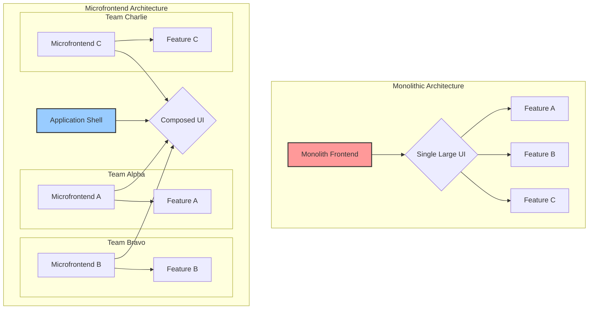
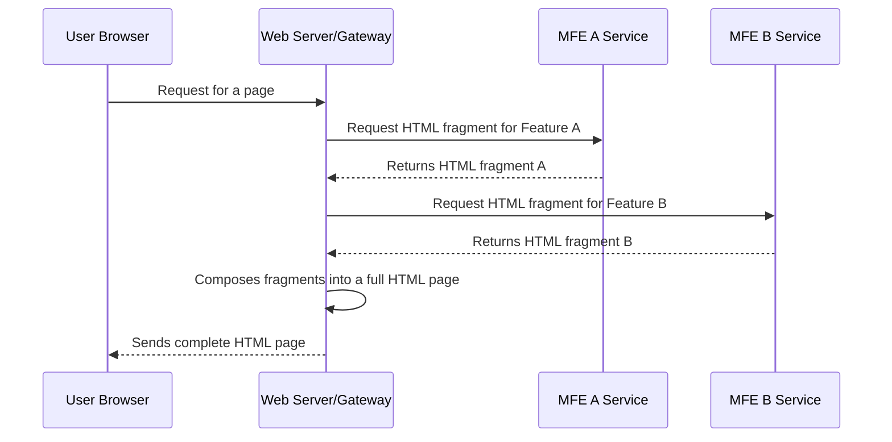
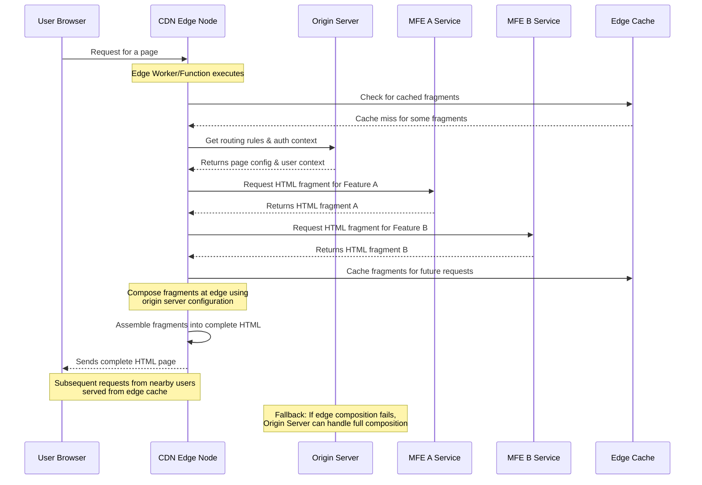
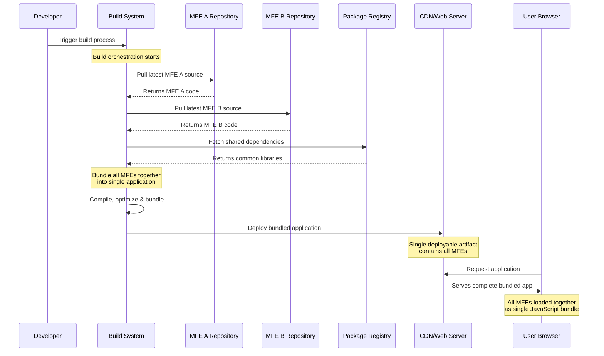

# Microfrontend Masterclass

## Table of Contents

- [Microfrontends](#microfrontends)
- [Use Cases](#use-cases)
- [Key Benefits](#key-benefits)
- [Core Principles](#core-principles)
- [Integration Approaches](#integration-approaches)
    - [Server-side composition](#server-side-composition)
    - [Edge-side composition](#edge-side-composition)
    - [Build-time composition](#build-time-composition)
    - [Runtime Integration](#runtime-integration)
        - [Iframes (strong isolation)](#iframes-strong-isolation)
        - [Web Components (Custom Elements + Shadow DOM)](#web-components-custom-elements--shadow-dom)
        - [Module Federation](#module-federation)
        - [Single-spa](#single-spa)
        - [Import maps + SystemJS](#import-maps--systemjs)
- [Code Organization](#code-organization)
    - [Monorepo](#monorepo)
    - [Polyrepo (one repo per MFE)](#polyrepo-one-repo-per-mfe)
        - [Lerna](#lerna)
        - [Nx](#nx)
        - [Turborepo](#turborepo)
- [Styling](#styling)
    - [BEM](#bem)
    - [SASS](#sass)
    - [CSS Modules](#css-modules)
    - [CSS-in-JS](#css-in-js)
    - [Shadow DOM](#shadow-dom)
- [Shared Component Library](#shared-component-library)
- [Cross-application Communication Strategies](#cross-application-communication-strategies)
    - [Custom Events](#custom-events)
    - [PostMessage](#postmessage)
    - [URL and Routing](#url-and-routing)
    - [Props and Callbacks](#props-and-callbacks)
- [Backend Communication](#backend-communication)
    - [BFF](#bff)
    - [GraphQL](#graphql)
- [Testing](#testing)
- [Infrastructure](#infrastructure)
- [Downsides](#downsides)

## Microfrontends

Microfrontends (MFEs) apply the microservices philosophy to the browser: split a large front-end into independently owned, developed, deployed, and runtime-composed vertical slices aligned to business domains.

Here’s a visual representation of the concept:



### Use Cases

- want to build a progressive or responsive web application, but can't find an easy place to start integrating these features into the existing code.
- want to start using new JavaScript language features (or one of the myriad languages that can compile to JavaScript), but you can't fit the necessary build tools into your existing build process.
- want to scale your development so that multiple teams can work on a single product simultaneously, but the coupling and complexity in the existing monolith means that everyone is stepping on each other's toes.

### Key Benefits

1.  **Technology Agnostic**: Each team should be able to choose its own technology stack for its microfrontend. One team might use React, another Vue, and a third Angular, all within the same composite application. This allows teams to use the best tool for the job and to experiment with new technologies without impacting the entire application.

2.  **Team Autonomy and Ownership**: Teams are organized around business domains and have end-to-end ownership of their microfrontend—from development and testing to deployment and maintenance. This autonomy empowers teams to work independently and release features at their own pace.

3.  **Domain-Driven and Vertical Slicing**: Microfrontends are sliced vertically based on business domains (e.g., search, checkout, user profile) rather than horizontally by technical layers (e.g., UI, business logic, data access). This aligns the architecture with the organizational structure (Conway's Law).

4.  **Resilience and Isolation**: The failure of one microfrontend should not bring down the entire application. The architecture should be resilient, with mechanisms to gracefully handle errors or unavailability of a microfrontend, ensuring a better user experience.

### Core Principles

- **Vertical slicing by business capability**: Organize around user-facing domains (e.g., `Catalog`, `Cart`, `Checkout`).
- **Independent build and deploy**: Each MFE has its own pipeline, versioning, and artifact.
- **Isolated execution**: Avoid global shared state; minimize shared dependencies; sandbox CSS and events.
- **Contract-first composition**: Clear integration contracts for routing, mounting APIs, events, and shared data.
- **Resilience and observability**: Each slice logs, traces, and degrades independently.

## Integration Approaches

- **Client-side composition**: Shell/aggregator app loads MFEs at runtime (e.g., Module Federation, single-spa, import maps + SystemJS).
- **Server-side composition**: Edge/origin stitches HTML fragments or streams partials (e.g., Edge Side Includes, Tailor, HTMX/partial SSR patterns).
- **Build-time composition**: Integrate at build/package time (monorepo libraries, plugin-based builds); simplest but least independent.
- **Hybrid**: Mix server-side for shell + client-side widgets for interactivity and late binding.

### Server-side composition

In this approach, the microfrontends are composed on the server, and a fully formed HTML page is sent to the browser. This is a classic Server-Side Rendering (SSR) model applied to microfrontends.



- **Pros**:
    - Excellent for SEO and initial page load performance (fast Time to First Byte - TTFB).
    - Simpler initial setup for the client.
    - Resilient, as the browser receives a complete page.
- **Cons**:
    - Server infrastructure can be complex to set up and maintain.
    - Less dynamic than client-side composition.
    - Can be slower to respond if fragment generation is slow.
- **Common Technologies**: Server-Side Includes (SSI), Edge Side Includes (ESI), frameworks like OpenComponents, Tailor.

### Edge-side composition

This is a variation of server-side composition where the assembly happens at the CDN edge (e.g., using Cloudflare Workers or AWS Lambda@Edge). This combines the performance benefits of SSR with the scalability and geographic distribution of a CDN.



- **Pros**:
    - Very fast, as composition happens close to the user.
    - Reduces load on origin servers.
    - Highly scalable.
- **Cons**:
    - Can be complex to implement and debug.
    - Tied to a specific CDN provider's technology.
    - "Cold starts" can impact performance.

### Build-time composition

This is the simplest approach, where MFEs are integrated at build/package time. This is often done using monorepo libraries or plugin-based builds.



```javascript
// package.json
{
  "dependencies": {
    "@company/header": "^1.2.3",
    "@company/checkout": "^2.1.0",
    "@company/product-list": "^3.0.1"
  }
}

// App.jsx
import Header from '@company/header';
import Checkout from '@company/checkout';
import ProductList from '@company/product-list';
```

**Pros:**
- Simple to understand
- Good TypeScript support
- Standard tooling works

**Cons:**
- Requires coordinated deployments
- Version management complexity
- Not truly independent

### Runtime Integration

This is where the true power of microfrontends shines. The integration happens at runtime, either on the client or the server. This allows for true independent deployments.

**Common Implementations**

- Iframes
- Web Components
- Module Federation
- Single-spa
- Import maps + SystemJS

### Iframes (strong isolation)

- **What it is**: OS-process level isolation in the browser with origin-based sandboxes.
- **Strengths**: Maximum isolation and security; trivial CSS/JS isolation; safe for untrusted content.
- **Challenges**: Integration overhead, sizing/scrolling issues, messaging via `postMessage`, SEO implications.
- **Use when**: Third-party apps, different security domains, gradual strangler without trust.

```html
<iframe 
  src="https://checkout.company.com" 
  id="checkout-frame"
  sandbox="allow-scripts allow-same-origin"
></iframe>

<script>
  // Communication via postMessage
  window.addEventListener('message', (e) => {
    if (e.origin !== 'https://checkout.company.com') return;
    
    if (e.data.type === 'checkout-complete') {
      handleCheckoutComplete(e.data.payload);
    }
  });
</script>
```

### Web Components (Custom Elements + Shadow DOM)

- **What it is**: Native browser component model with encapsulated markup, styles, and behavior.
- **Strengths**: Strong CSS isolation via Shadow DOM; framework-agnostic; long-lived contracts.
- **Challenges**: DX compared to React/Vue; SSR and hydration patterns require extra work; state management is manual.
- **Resources**: [MDN](https://developer.mozilla.org/docs/Web/Web_Components), [Lit](https://lit.dev/)

```javascript
// Microfrontend Registration
class ProductWidget extends HTMLElement {
  connectedCallback() {
    const mountPoint = document.createElement('div');
    this.attachShadow({ mode: 'open' }).appendChild(mountPoint);
    ReactDOM.render(<ProductApp />, mountPoint);
  }
}
customElements.define('product-widget', ProductWidget);

// Usage in any app
<product-widget 
  product-id="123" 
  theme="dark"
></product-widget>
```

### Module Federation

- **What it is**: Runtime module loading across separately built apps; hosts consume remotes; dependencies can be shared/singleton.
- **Strengths**: Late binding, independent deploys, version negotiation; great for SPA shells and route-sliced apps.
- **Challenges**: Webpack coupling; requires discipline on shared versions and contracts.
- **Getting started**: [Docs](https://webpack.js.org/concepts/module-federation/), [Guide](https://module-federation.github.io/)
- **Typical pattern**: Shell with a `ModuleFederationPlugin` consuming `remoteEntry.js` from each MFE; remotes expose mount functions.

```javascript
// webpack.config.js - Host App
module.exports = {
  plugins: [
    new ModuleFederationPlugin({
      name: 'host',
      remotes: {
        productApp: 'productApp@http://localhost:3001/remoteEntry.js',
        cartApp: 'cartApp@http://localhost:3002/remoteEntry.js'
      },
      shared: {
        react: { singleton: true, eager: true },
        'react-dom': { singleton: true, eager: true }
      }
    })
  ]
};

// webpack.config.js - Remote App
module.exports = {
  plugins: [
    new ModuleFederationPlugin({
      name: 'productApp',
      filename: 'remoteEntry.js',
      exposes: {
        './ProductList': './src/ProductList',
        './ProductDetail': './src/ProductDetail'
      },
      shared: {
        react: { singleton: true },
        'react-dom': { singleton: true }
      }
    })
  ]
};

// Usage in Host App
const ProductList = React.lazy(() => import('productApp/ProductList'));

function App() {
  return (
    <Suspense fallback="Loading...">
      <ProductList />
    </Suspense>
  );
}
```

### Single-spa

- **What it is**: A framework-agnostic microfrontend orchestrator that mounts/unmounts applications based on route/activity functions.
- **Strengths**: Multiple frameworks on one page; simple lifecycle; good for gradual migrations.
- **Challenges**: Payload size and boot time; requires careful shared deps and style isolation.
- **Resources**: [Docs](https://single-spa.js.org/)

```javascript
// Root config
import { registerApplication, start } from 'single-spa';

registerApplication({
  name: '@company/navbar',
  app: () => System.import('@company/navbar'),
  activeWhen: () => true, // Always active
});

registerApplication({
  name: '@company/products',
  app: () => System.import('@company/products'),
  activeWhen: ['/products'],
});

registerApplication({
  name: '@company/checkout',
  app: () => System.import('@company/checkout'),
  activeWhen: ['/checkout'],
});

start();

// Individual app lifecycle
export function bootstrap(props) {
  return Promise.resolve();
}

export function mount(props) {
  return ReactDOM.render(<App />, props.domElement);
}

export function unmount(props) {
  return ReactDOM.unmountComponentAtNode(props.domElement);
}
```

### Import maps + SystemJS

- **What it is**: Use import maps to map bare specifiers to URLs; SystemJS can load modules in browsers lacking native support.
- **Strengths**: Declarative version flipping; CDN-friendly; pairs well with SSR/edge composition.
- **Challenges**: Browser support nuances; operational discipline for map updates.
- **Resources**: [Import maps spec](https://wicg.github.io/import-maps/), [MDN](https://developer.mozilla.org/docs/Web/HTML/Element/script/type/importmap), [SystemJS](https://github.com/systemjs/systemjs)

```html
<script type="importmap">
  {
    "imports": {
      "catalog": "https://cdn.example.com/catalog/1.9.0/remoteEntry.js",
      "cart": "https://cdn.example.com/cart/2.3.1/remoteEntry.js",
      "react": "https://cdn.example.com/vendor/react/18.2.0/react.production.min.js"
    }
  }
</script>
```

```javascript
// Usage in any app
import 'catalog';
import 'cart';
```

## Code Organization

### Monorepo

```
/my-microfrontend-monorepo
├── packages/
│   ├── app-shell/         # The container application
│   │   ├── src/
│   │   └── package.json
│   ├── mfe-product/       # Product feature microfrontend
│   │   ├── src/
│   │   └── package.json
│   ├── mfe-checkout/      # Checkout feature microfrontend
│   │   ├── src/
│   │   └── package.json
│   └── shared-ui/         # Shared component library
│       ├── src/
│       └── package.json
├── package.json           # Root package.json
└── lerna.json             # Monorepo tool configuration
```

**Tools**: Lerna, Nx, Turborepo

When to use a monorepo:
- When you have a single organization with shared tools, libraries, and a common technology stack.
- When you need to make atomic changes across multiple microfrontends.
- When you need to share code between microfrontends.

### Polyrepo (one repo per MFE)

```
- repo: app-shell/
- repo: mfe-product/
- repo: mfe-checkout/
- repo: shared-ui/
```

When to use a polyrepo:
- When you have very strong organizational boundaries and teams that need extreme autonomy.
- When different parts of the application have vastly different technology stacks or release cycles that are fundamentally incompatible.
- In a highly distributed, open-source-style collaboration model.

#### Lerna

#### Nx

#### Turborepo

## Styling

### BEM

### SASS

### CSS Modules

### CSS-in-JS

### Shadow DOM

## Shared Component Library


## Cross-application Communication Strategies

### Custom Events

This pattern uses the browser's native event system to create a simple, decoupled communication channel. Microfrontends can dispatch custom events, and any other microfrontend can listen for them without needing a direct reference.

-   **How it works**: One microfrontend dispatches a `CustomEvent` on the `window` object. Other microfrontends add event listeners to the `window` to catch and handle these events.
-   **When to use it**: Great for "fire-and-forget" notifications where the sender doesn't need a response, such as "item added to cart" or "user logged in."
-   **Pros**: Highly decoupled, framework-agnostic.
-   **Cons**: Can be hard to debug if there are many events. It's important to establish a clear naming convention and data structure for events.

**Code Example**:

```javascript
// Publisher
window.dispatchEvent(new CustomEvent('cart:item-added', {
  detail: { productId: '123', quantity: 1 }
}));

// Subscriber
window.addEventListener('cart:item-added', (event) => {
  updateCartCount(event.detail);
});
```

### PostMessage

This pattern uses the `window.postMessage` API to send messages between different microfrontends. It's a simple and effective way to pass data between microfrontends.

-   **How it works**: One microfrontend sends a message to another microfrontend using the `window.postMessage` API. The other microfrontend listens for messages using the `window.addEventListener` API.
-   **When to use it**: Suitable for passing data between microfrontends that are on different domains.
-   **Pros**: Simple, reliable, follows web standards.
-   **Cons**: Not suitable for frequent, small-scale updates or for passing complex data objects.

**Code Example**:

```javascript
// Publisher
window.postMessage('cart:item-added', 'https://checkout.company.com', {
  detail: { productId: '123', quantity: 1 }
});
```

### URL and Routing

This pattern uses the browser's native URL and routing system to create a simple, decoupled communication channel. Microfrontends can navigate to a new URL or update the current URL with new parameters. The application shell's router detects the change and loads or updates the appropriate microfrontend, passing in the new parameters.

-   **How it works**: One microfrontend navigates to a new URL or updates the current URL with new parameters. The application shell's router detects the change and loads or updates the appropriate microfrontend, passing in the new parameters.
-   **When to use it**: Ideal for passing page-level context, such as product IDs, search queries, or tab selections.
-   **Pros**: Simple, reliable, follows web standards.
-   **Cons**: Not suitable for frequent, small-scale updates or for passing complex data objects.

**Code Example**:

```javascript
// App A - Navigate with state
history.pushState(
  { productId: '123' }, 
  '', 
  '/checkout?product=123'
);

// App B - Read state
const params = new URLSearchParams(location.search);
const productId = params.get('product');
```

### Props and Callbacks

This pattern uses the `mount` function to pass props and callback functions to the microfrontend. The microfrontend can then use the props and callback functions to update the state in the application shell.

-   **How it works**: The application shell's `mount` function passes props and callback functions to the microfrontend. The microfrontend can then use the props and callback functions to update the state in the application shell.
-   **When to use it**: Suitable for parent-child relationships where the application shell needs to orchestrate the behavior of its children.
-   **Pros**: Explicit and easy to follow the data flow.
-   **Cons**: Can be hard to debug if there are many props and callback functions.

**Code Example**:

```javascript
// Parent container
function Container() {
  const [user, setUser] = useState(null);
  
  return (
    <>
      <HeaderMicrofrontend user={user} />
      <ProfileMicrofrontend 
        user={user} 
        onUpdate={setUser} 
      />
    </>
  );
}
```


## Backend Communication

### BFF

### GraphQL

## Testing

## Infrastructure

## Downsides
